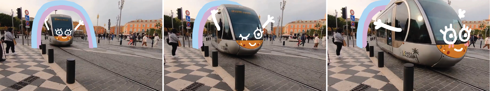

# Video Doodles: Hand-Drawn Animations on Videos with Scene-Aware Canvases



This repository contains source code related to a research paper: [webpage](https://em-yu.github.io/research/videodoodles/), [paper](https://www-sop.inria.fr/reves/Basilic/2023/YBNWKB23/VideoDoodles.pdf), [ACM page](https://dl.acm.org/doi/abs/10.1145/3592413).

The subfolders contain further instructions to run the code for [preprocessing](preprocess) and to set up the [web application](app).

If this code is useful to your research, please consider citing the publication:

```
@article{videodoodles,
  author = {Yu, Emilie and Blackburn-Matzen, Kevin and Nguyen, Cuong and Wang, Oliver and Habib Kazi, Rubaiat and Bousseau, Adrien},
  title = {VideoDoodles: Hand-Drawn Animations on Videos with Scene-Aware Canvases},
  year = {2023},
  publisher = {Association for Computing Machinery},
  doi = {10.1145/3592413},
  journal = {ACM Trans. Graph.},
  articleno = {54},
  numpages = {12},
}
```

## Contact

Emilie Yu: emiliextyu@gmail.com